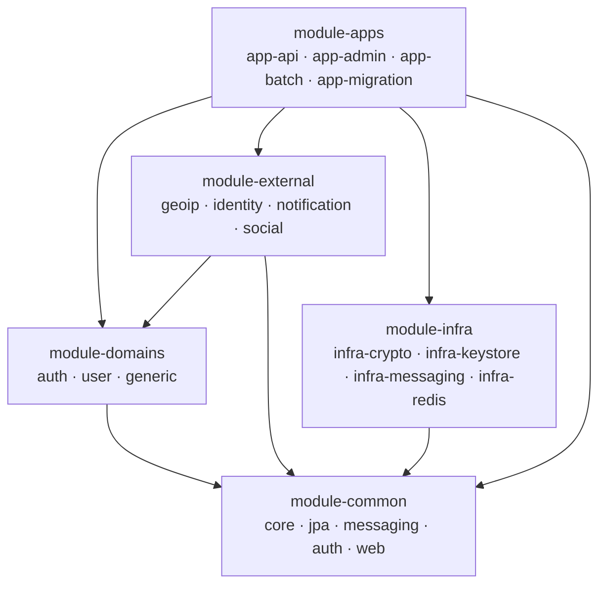

# Spring Boot Auth


회원 인증·계정·세션 관리를 제공하는 통합 인증 백엔드입니다. Spring Boot 기반 모듈러 모놀리스로, 도메인 경계를 패키지 컨벤션이 아니라 Gradle 모듈 컴파일 의존성으로 강제합니다.

## 애플리케이션 이해하기

인증·회원·범용 3개 도메인으로 구성합니다. 각 도메인은 독립 Gradle 모듈이며 다른 도메인을 컴파일 의존으로 참조하지 않습니다.

| 도메인 | 담는 것 |
| --- | --- |
| `domain-auth` | 로그인·세션·토큰·자격증명(비밀번호·소셜 연결)·디바이스·계정 잠금 |
| `domain-user` | 회원 계정·프로필·본인인증(CI/DI)·약관/동의·RBAC(역할·권한) |
| `domain-generic` | 도메인 색이 옅은 범용 기능 — 알림·감사 로그 |

도메인 간 협력은 앱 계층의 파사드 조율과 도메인 이벤트로만 이어지고, 데이터베이스에도 크로스 도메인 FK를 두지 않습니다. 외부 연동(소셜·본인인증·알림·GeoIP)은 도메인이 소유한 포트를 `module-external`이 구현하며, 개발·테스트 환경에서는 Mock 어댑터로 대체합니다. 의존은 항상 한 방향으로만 흐릅니다.



모듈 구조와 설계 결정의 자세한 내용은 [`docs/architecture.md`](docs/architecture.md)를 참고하세요.

| 구분 | 기술 |
| --- | --- |
| 언어·프레임워크 | Java 25 · Spring Boot 4.1 |
| 인증·보안 | Spring Security · JWT(Nimbus JOSE) · Argon2id · PII 봉투 암호화 · blind index |
| 데이터 | PostgreSQL 17 · Redis 7 · Flyway · Spring Data JPA + QueryDSL |
| 테스트·품질 | JUnit 5 · Testcontainers · ArchUnit · Spotless · NullAway · Error Prone |
| 빌드·CI | Gradle 9.5 (Kotlin DSL + 버전 카탈로그) · GitHub Actions |

## 로컬에서 실행하기

컨테이너 스택으로 전체 앱을 한 번에 띄웁니다. Docker만 있으면 됩니다.

```bash
git clone https://github.com/sangjaeoh/spring-boot-auth.git
cd spring-boot-auth
docker compose up --build
```

`app-migration`을 init 컨테이너로 선행 실행해 스키마별 Flyway를 전량 적용하고 성공 종료한 뒤 API·Admin을 띄웁니다. 앱 이미지를 컨테이너 안에서 빌드하므로 첫 실행은 수 분 걸립니다.

- API: `http://localhost:8080`
- Admin: `http://localhost:8081`
- OpenAPI 계약(스펙): `http://localhost:8080/v3/api-docs`

> 로컬 스택은 dev 전용 고정 암호화 키(throwaway)로 PII를 암호화합니다 — `POSTGRES_PASSWORD`와 같은 성격의 개발값입니다. 운영 배포는 시크릿 매니저가 같은 변수명으로 키를 주입합니다([`docs/ops/deployment.md`](docs/ops/deployment.md)).

## IDE에서 작업하기

코드를 수정하며 돌릴 때는 로컬 JVM으로 실행합니다. JDK 25와 Docker가 필요합니다.

1. PostgreSQL·Redis만 띄웁니다(앱은 Gradle로 직접 실행).

   ```bash
   docker compose up -d postgres redis --wait
   ```

2. 개발 시크릿을 만들어 셸에 주입합니다. 앱은 PII 암호화 키가 없으면 기동 시 fail-fast합니다.

   ```bash
   ./scripts/generate-dev-secrets.sh                          # 최초 1회
   set -a; source .dev-secrets.env; set +a
   ```

3. 스키마를 마이그레이션합니다. `app-migration`이 도메인 스키마마다 Flyway를 실행하고 종료합니다.

   ```bash
   ./gradlew :module-apps:app-migration:bootRun
   ```

4. API 앱을 띄웁니다.

   ```bash
   ./gradlew :module-apps:app-api:bootRun
   ```

IDE에서는 루트의 Gradle 프로젝트를 임포트하면 전 모듈이 함께 열립니다.

## 데이터베이스 구성

- PostgreSQL은 도메인마다 스키마 하나(`auth`·`usr`·`generic`)를 소유하고, 기술 스키마(`msg` — 메시징 디둡·DLQ, `keyring` — JWT 서명키 원장)를 별도로 둡니다. 스키마는 Flyway 마이그레이션이 소유하고, 앱은 기동 시 엔티티↔DDL 일치만 검증합니다(`ddl-auto: validate`).
- Redis는 세션 저장소로 사용합니다. 세션(진실원본)·온보딩/본인인증 진행 상태·멱등 키·레이트리밋을 담습니다.
- PII는 봉투 암호화(KEK)로 저장하고, 조회 키는 blind index로 색인합니다. KEK·pepper 원문은 레포에 두지 않고 환경변수로 주입합니다(로컬은 `scripts/generate-dev-secrets.sh`).

## 빌드와 테스트

```bash
./gradlew build
```

빌드에 Spotless·NullAway·Error Prone·ArchUnit 게이트가 배선되어 있어, 포맷·null 계약·정적 분석·아키텍처 규칙 위반이 있으면 빌드가 실패합니다. 포맷 위반은 `./gradlew spotlessApply`로 자동 교정합니다. 같은 게이트를 GitHub Actions가 main 푸시·PR에서 원격 강제합니다.

## 더 알아보기

| 문서 | 내용 |
| --- | --- |
| [`AGENTS.md`](AGENTS.md) | 개발 규칙 진입 앵커 |
| [`docs/architecture.md`](docs/architecture.md) | 모듈·패키지 구조, 의존 방향, 빌드가 강제하는 불변식 |
| [`docs/coding-conventions.md`](docs/coding-conventions.md) | 타입 선언, 객체 생성·변환, 네이밍 |
| [`docs/entity-persistence.md`](docs/entity-persistence.md) | 엔티티 ID(UUIDv7), 버저닝, 연관 규칙 |
| [`docs/code-quality.md`](docs/code-quality.md) | Spotless·NullAway·Error Prone 게이트 |
| [`docs/ops/`](docs/ops) | 배포·관측성·SLO·위협 모델·DR 런북 |
| [`DOMAIN_MODEL.md`](DOMAIN_MODEL.md) | 도메인 모델 |
| [`REQUIREMENTS.md`](REQUIREMENTS.md) | 기능 요구사항 |
